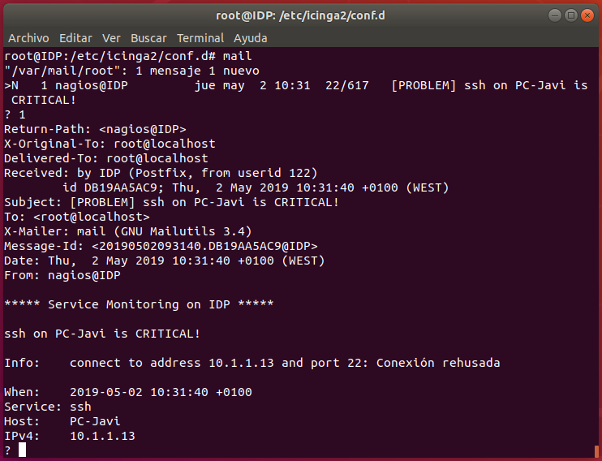

## Notificaciones

**Icinga 2** puede enviar notificaciones por email en caso de que un servicio no responda. Para ello podemos instalar un servidor de correo en la misma máquina. 

```bash
sudo apt-get install postfix mailutils
```

Una vez hecho esto, podemos editar el fichero `/etc/icinga2/conf.d/users.conf` y modificar el atributo **email** del usuario por defecto **icingaadmin**

```
object User "icingaadmin" {
  import "generic-user"

  display_name = "Icinga 2 Admin"
  groups = [ "icingaadmins" ]

  email = "root@localhost"
}

object UserGroup "icingaadmins" {
  display_name = "Icinga 2 Admin Group"
}
```

Ahora, debemos añadir el siguiente atributo a cada uno de los hosts de los que queremos recibir notificaciones:

```
vars.notification["mail"] = {
    groups = [ "icingaadmins" ]
}
```

Y reiniciamos el servicio

```bash
sudo systemctl restart icinga2
```

Ejemplo de notificación recibido en el momento que el servicio **ssh** del host **PC-Javi** ha fallado.

