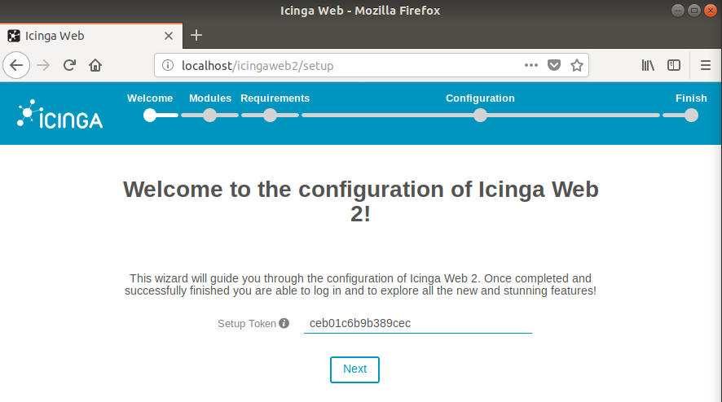
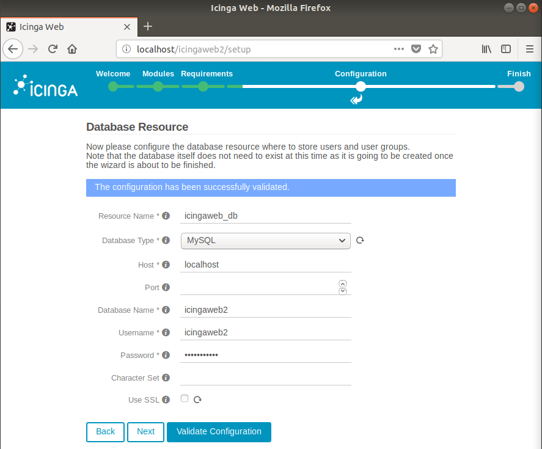
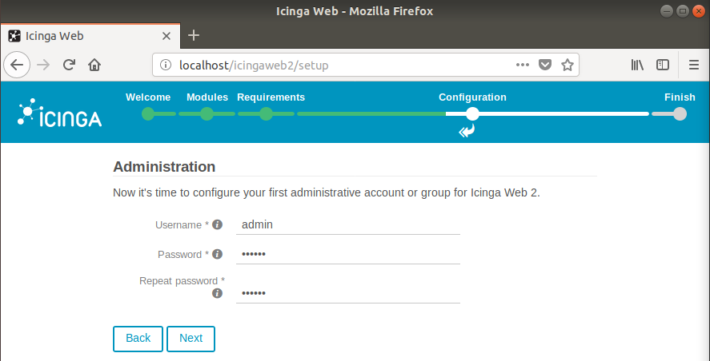
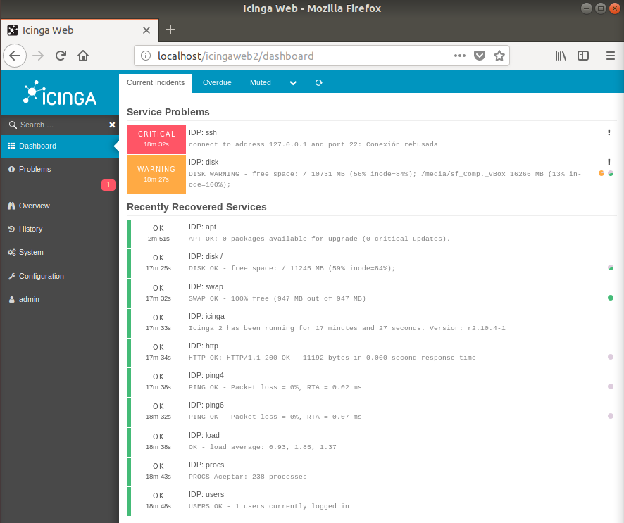

# Icinga

## ¿Que és Icinga?

Icinga es un sistema de monitorización opensource, que controla cualquier recurso de la red, notifica al usuario los errores, genera datos de rendimiento para la presentación de informes e informa del estado de los recursos. Es escalable y extensible, Icinga puede controlar entornos complejos y grandes a través de lugares dispersos.

Icinga es un fork de Nagios y es compatible con versiones anteriores. Por lo tanto, la configuración de Nagios, plugins y addons se pueden usar con Icinga. Aunque Icinga conserva todas las características existentes de su predecesor, se basa en ellos para añadir muchas funcionalidades que no se encuentran en Nagios y características solicitadas por la comunidad de usuarios.

## Instalación en Ubuntu 18.04 Bionic

1. Instalar el repositorio de Icinga2:

    ```bash
    sudo apt-get install apt-transport-https

    sudo wget -qO - https://packages.icinga.com/icinga.key | sudo apt-key add -

    sudo add-apt-repository "deb https://packages.icinga.com/ubuntu icinga-bionic main"
    ```

2. Instalar Icinga2:

    ```bash
    sudo apt-get update

    sudo apt-get install icinga2 monitoring-plugins
    ```

3. Habilitar acceso remoto a Icinga2:

    ```bash
    sudo icinga2 api setup
    ```

    Una vez inicializado el acceso remoto debemos de añadir un usuario en el fichero `/etc/icinga2/conf.d/api-users.conf`:

    ```
    object ApiUser "api_user" {
        password = "12345678"
        permissions = [ "*" ]
    }
    ```

    Ahora reiniciaremos el servicio para aplicar los cambios efectuados:

    ```bash
    sudo systemctl restart icinga2
    ```

4. Interfaz web:

    Para instalar la interfaz web, primero debemos de instalar el driver de MYSQL para Icinga2.

    4.1. Instalación driver mysql para Icinga2:
    
    ```bash
    sudo apt-get install mysql-client mysql-server icinga2-ido-mysql
    
    sudo mysql_secure_installation
    ```
    
    4.2. Creación de base de datos:
    
    ```
    mysql -u root -p

    CREATE DATABASE icinga2;
    GRANT ALL ON icinga2.* TO 'icinga2'@'localhost' IDENTIFIED BY 'Icinga_2';
    quit
    ```
    ```
    mysql -u root -p icinga2 < /usr/share/icinga2-ido-mysql/schema/mysql.sql
    ```
    
    4.3. Creación de usuario para el módulo:
    
    Editamos el fichero `/etc/icinga2/features-available/ido-mysql.conf`:
    
    ```
    object IdoMysqlConnection "ido-mysql-2" {
        user = "icinga2",
        password = "Icinga_2",
        host = "localhost",
        database = "icinga2"
    }
    ```
    
    4.4. Habilitar módulo de MYSQL:
    
    ```bash
    sudo icinga2 feature enable ido-mysql
    ```
    
    Ahora reiniciaremos el servicio para aplicar los cambios efectuados:

    ```bash
    sudo systemctl restart icinga2
    ```
    
    4.5. Instalación de la interfaz web:
    
    ```bash
    sudo apt-get install apache2 icingaweb2 icingacli libapache2-mod-php
    ```
    
    4.6. Creación de base de datos para la interfaz:
    
    ```
    mysql -u root -p

    CREATE DATABASE icingaweb2;
    GRANT ALL ON icingaweb2.* TO 'icingaweb2'@'localhost' IDENTIFIED BY 'Icingaweb_2';
    quit
    ```
    
    4.7. Generar token de configuración:
    
    ```bash
    sudo icingacli setup token create
    ```
    
    4.8. Reinicio del servicio apache2

    ```bash
    sudo systemctl restart apache2
    ```

## Instalación con Ansible

Para simplificar la instalación hemos utilizado [Ansible](https://www.ansible.com/), que es un framework de automatización de tareas. En el directorio `icinga/ansible` se encuentra un script bash que realiza la instalación de Ansible y a continuación instala Icinga. 

Para utilizar este método, clonaremos el repositorio de instalación en el servidor:

```bash
git clone https://github.com/asir-idp/icinga.git

cd icinga

./instalar-maestro.sh
```

## Configuración

Accedemos a Icinga Web desde el navegador usando la url "localhost/icingaweb2/setup":

1. Introducimos el "Setup Token" que se encuentra en el fichero IDP.icingaweb2 en el directorio ansible:

    <p>
    
    </p>

    <p>
    
    </p>

2. En el siguiente paso, introducimos los datos para configurar la base de datos para la interfaz web (Los datos a introducir se encuentran en el mismo fichero del paso anterior):

    <p>
    
    </p>

3. En este paso, indicamos las credenciales que tendrá nuestro usuario administrador en Icinga Web 2:

    <p>
    
    </p>

4. En este paso, introducimos los datos de acceso a la base de datos del módulo de MYSQL para Icinga:

    <p>
    
    </p>

5. Introducimos los datos de acceso a la API remota:

    <p>
    
    </p>

6. Comprobamos la configuración ha concluido satisfactoriamente:

    <p>
    
    </p>

7. Accedemos con el usuario administrativo creado y comprobamos que funciona correctamente:

    <p>
    
    </p>

## Monitorización

Icinga2 soporta distintos tipos de monitorización:

* Maestro único
* Maestro - clientes
* Maestro - satélite - clientes

Y cada uno de estos tipos soporta varios modos de funcionamiento.

En nuestro caso hemos elegido el tipo más común que es el de Maestro único. En este modo, un maestro Icinga comprueba los servicios remotos en los nodos de la red.

Para configurar este modo editaremos el fichero `/etc/icinga2/conf.d/hosts.conf` y añadiremos los hosts que queremos monitorizar, como por ejemplo:

```
object Host "NombreNodo" {
    import "generic-host"
    address = "192.168.0.5"
}
```

<p>

</p>

Y ahora editamos el fichero `/etc/icinga2/conf.d/services.conf` para añadir los servicios que queremos monitorizar, como por ejemplo:

```
object Service "ssh" {
    host_name = "NombreNodo"
    check_command = "ssh"
}
```
Con este ejemplo, hemos usado el módulo `ssh` de Icinga para monitorizar el puerto 22 de ssh así como obtener información básica del servicio en este host en concreto.

Si quisieramos que ese servicio se comprobase en todos los hosts, utilizariamos la siguiente sintaxis:

```
apply Service "ssh" {
    check_command = "ssh"
    assign where host.address
}
```

Con este ejemplo hemos utilizado la directiva `apply` para monitorizar el servicio `ssh` en todos los hosts que tengan definida una dirección IP en nuestra configuración.

Repetiremos este paso tantas veces como servicios queremos monitorizar.

<p>

</p>

<p>

</p>

## Notificaciones

Icinga 2 puede enviar notificaciones por email en caso de que un servicio no responda. Para ello podemos instalar un servidor de correo en la misma máquina. 

```bash
sudo apt-get install postfix mailutils
```

Una vez hecho esto, podemos editar el fichero `/etc/icinga2/conf.d/users.conf` y modificar el atributo **email** del usuario por defecto **icingaadmin**

```python
object User "icingaadmin" {
  import "generic-user"

  display_name = "Icinga 2 Admin"
  groups = [ "icingaadmins" ]

  email = "root@localhost"
}

object UserGroup "icingaadmins" {
  display_name = "Icinga 2 Admin Group"
}
```

Ahora, debemos añadir el siguiente atributo a cada uno de los hosts de los que queremos recibir notificaciones:

```
vars.notification["mail"] = {
    groups = [ "icingaadmins" ]
}

```

Y reiniciamos el servicio

```bash
sudo systemctl restart icinga2

```

Ejemplo de notificación recibido en el momento que el servicio **ssh** del host **PC-Javi** ha fallado.

<p>

</p>