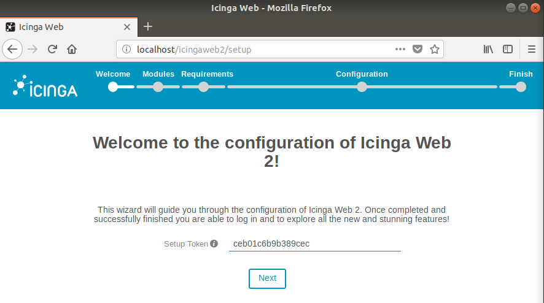
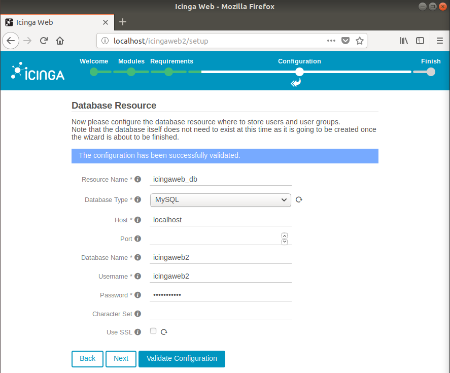
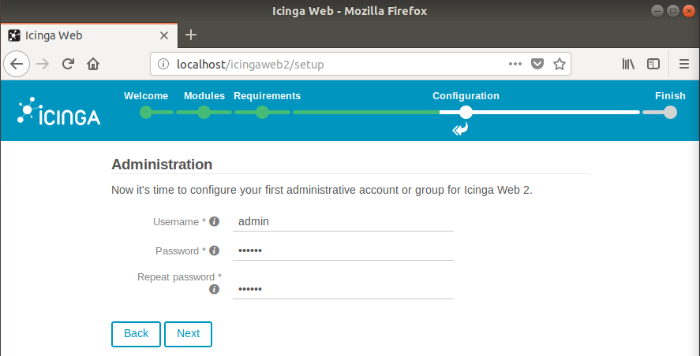
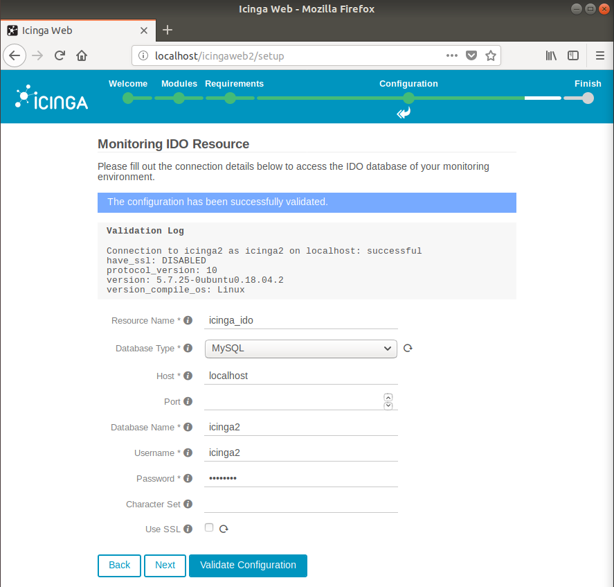
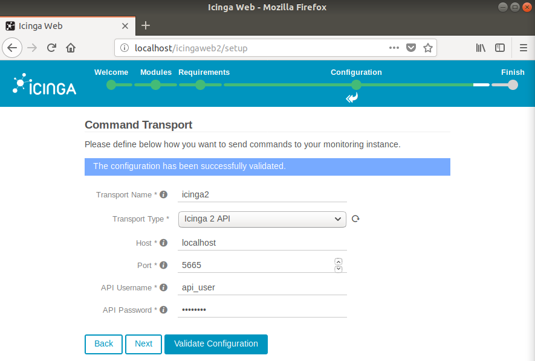
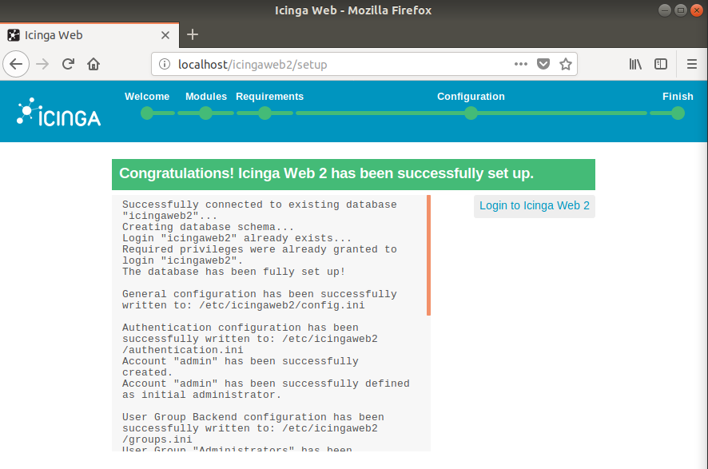
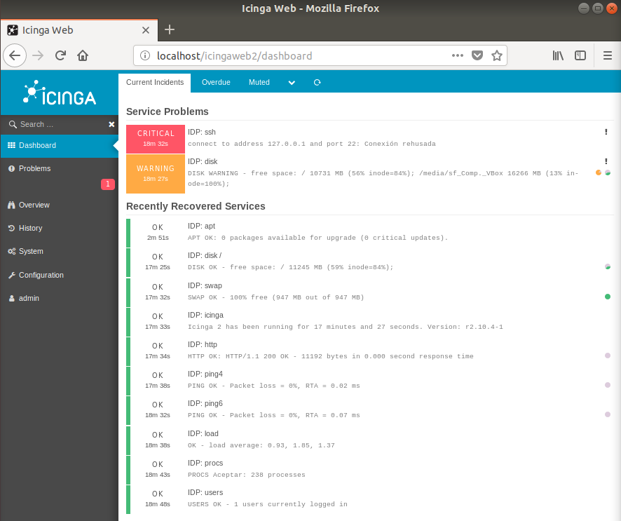

## Configuración

Accedemos a **Icinga Web** desde el navegador usando la url "localhost/icingaweb2/setup":

1. *Introducimos el **"Setup Token"** que se encuentra en el fichero **IDP.icingaweb2** en el directorio ansible:*

2. *En el siguiente paso, introducimos los datos para configurar la base de datos para la interfaz web (Los datos a introducir se encuentran en el mismo fichero del paso anterior):*

3. *En este paso, indicamos las credenciales que tendrá nuestro **usuario administrador** en Icinga Web 2:*

4. *En este paso, introducimos los datos de acceso a la base de datos del módulo de **MYSQL** para Icinga:*

5. *Introducimos los datos de acceso a la **API remota**:*

6. *Comprobamos la configuración ha concluido satisfactoriamente:*

7. *Accedemos con el usuario administrativo creado y comprobamos que funciona correctamente:*

[Volver](..)