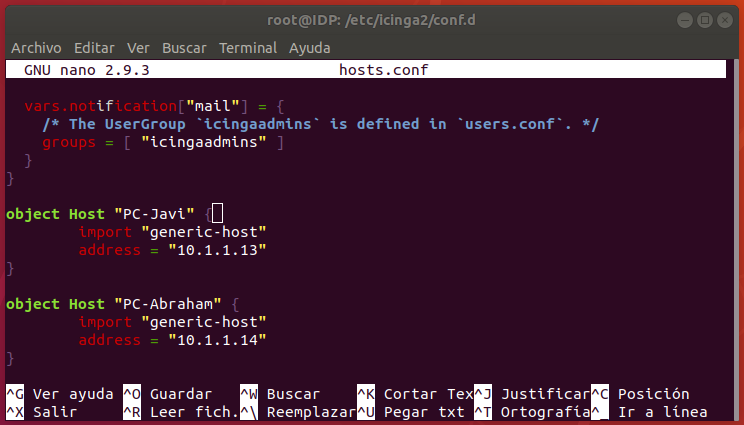
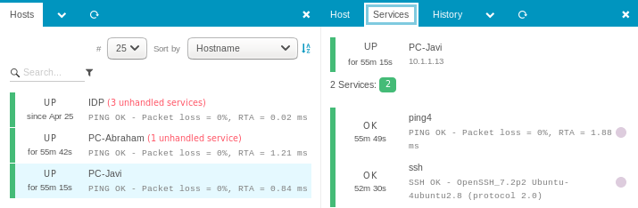
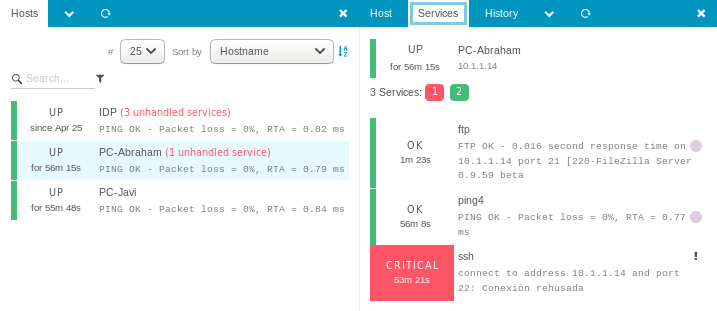

## Monitorización

**Icinga2** soporta distintos tipos de monitorización:

* Maestro único
* Maestro - clientes
* Maestro - satélite - clientes

Y cada uno de estos tipos soporta varios modos de funcionamiento.

En nuestro caso hemos elegido el tipo más común que es el de ***Maestro único***. En este modo, 
un maestro Icinga comprueba los servicios remotos en los nodos de la red.

También veremos como podemos obtener más información de los nodos de la red mediante el uso
de diversos módulos.

Un fichero de configuración de ejemplo se puede consultar en este enlace: [ejemplo.conf](ejemplo.conf).

### Monitorización de servicios remotos

Para configurar este modo editaremos el fichero `/etc/icinga2/conf.d/hosts.conf` y añadiremos 
los *hosts* que queremos monitorizar, como por ejemplo:

```
object Host "NombreNodo" {
    import "generic-host"
    address = "192.168.0.5"
}
```



Y ahora editamos el fichero `/etc/icinga2/conf.d/services.conf` para añadir los *servicios* 
que queremos monitorizar, como por ejemplo:

```
object Service "ssh" {
    import "generic-service"
    host_name = "NombreNodo"
    check_command = "ssh"
}
```
Con este ejemplo, hemos usado el módulo `ssh` de Icinga para monitorizar el puerto 22 de ssh 
así como obtener información básica del servicio en este host en concreto.

Si quisieramos que ese servicio se comprobase en todos los hosts, utilizariamos la siguiente sintaxis:

```
apply Service "ssh" {
    check_command = "ssh"
    assign where host.address
}
```

Con este ejemplo hemos utilizado la directiva `apply` para monitorizar el servicio `ssh` en todos 
los hosts que tengan definida una dirección IP en nuestra configuración.

Repetiremos este paso tantas veces como servicios queremos monitorizar.





### Monitorización de sistemas Windows

Para monitorizar sistemas Windows necesitaremos instalar el programa [NSClient++](https://www.nsclient.org/).

Se trata de un servicio de monitorización que soporta diversos protocolos. Icinga puede trabajar directamente
con este servicio mediante el módulo: **nscp**.

Ejemplo de configuración:

```
object Service "nsclient-disk" {
	import "generic-service"
	host_name = "NodoWindows"
	check_command = "nscp"
	
	/* la métrica que queremos obtener */
	vars.nscp_variable = "USEDDISKSPACE"
	
	/* la letra de la unidad de disco */
	vars.nscp_params = "c"
	
	/* niveles de aviso */
	vars.nscp_warn = 70
	vars.nscp_crit = 80
	
	/* contraseña de acceso a nsclient */
	vars.nscp_password = "12345"
	
	vars.notification["mail"] = {
		groups = [ "icingaadmins" ]
	}
}
```

### Monitorización de sistemas Linux

Podemos aprovechar el protocolo SSH para monitorizar sistemas Linux. Para ello usaremos el módulo **by_ssh** de Icinga.

Necesitaremos tener configurado el acceso mediante clave pública en la máquina que queramos monitorizar.

Ejemplo de configuración:

```
object Service "ssh-disk" {
	import "generic-service"
	host_name = "NodoLinux"
	check_command = "by_ssh"
	
	/* check_disk se encuentra en el paquete "monitoring-plugins" de ubuntu */
	vars.by_ssh_command = "/usr/lib/nagios/plugins/check_disk -w 30% -c 15% /"
	
	/* nombre de usuario remoto */
	vars.by_ssh_logname = "usuario"
	
	/* clave privada en disco, accesible por el usuario local "nagios" */
	vars.by_ssh_identity = "/var/lib/nagios/.ssh/id_rsa"
	
	vars.notification["mail"] = {
		groups = [ "icingaadmins" ]
	}
}
```

[Volver](index.md)
